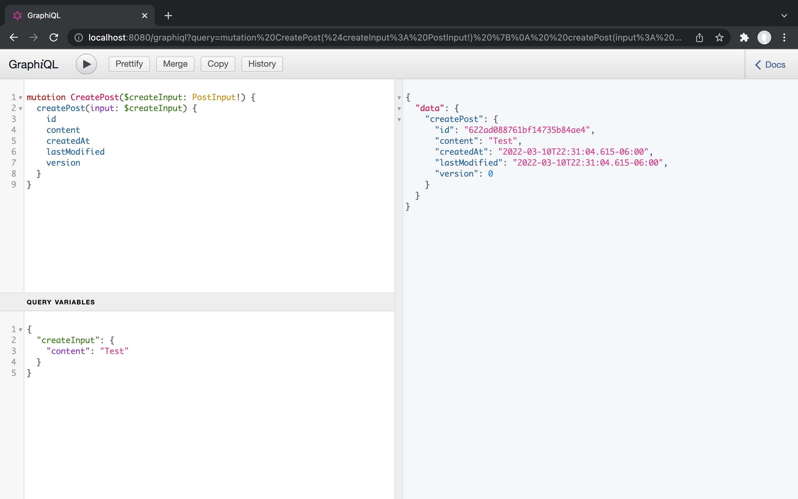
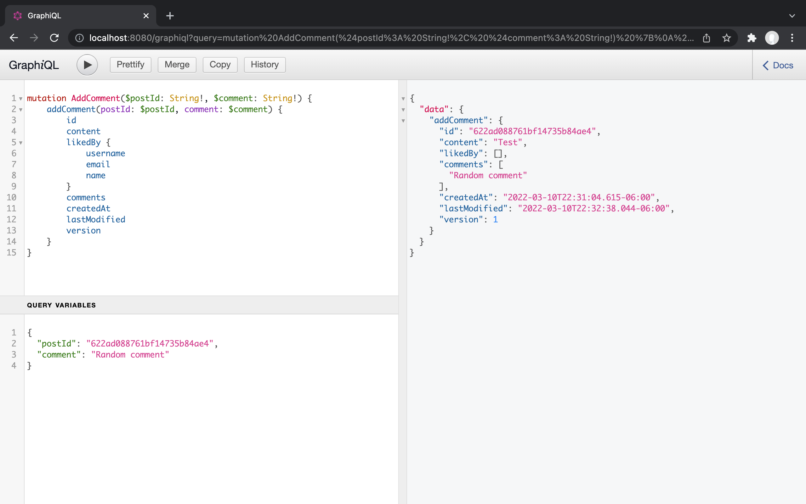
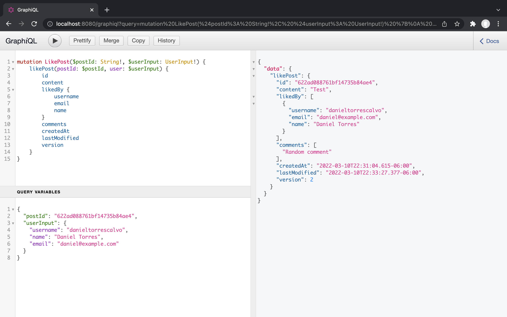

[![Portfolio][portfolio-shield]][portfolio-url]
[![LinkedIn][linkedin-shield]][linkedin-url]

<!-- PROJECT LOGO -->

    
    <h3 align="center">Java-GraphQL-MongoDB</h3>

<!-- ABOUT THE PROJECT -->

This is an example of how you can develop an API using GraphQL with Java and MongoDB

### Create Post
 

### Add Comment
 

### Like Post
 

<!-- MARKDOWN LINKS & IMAGES -->

[portfolio-shield]: https://img.shields.io/badge/-Portfolio-black.svg?style=for-the-badge&logo=portfolio&colorB=555
[portfolio-url]: https://dtorres-portfolio.netlify.app/
[linkedin-shield]: https://img.shields.io/badge/-LinkedIn-black.svg?style=for-the-badge&logo=linkedin&colorB=555
[linkedin-url]: https://linkedin.com/in/daniel-torres-1996abc
